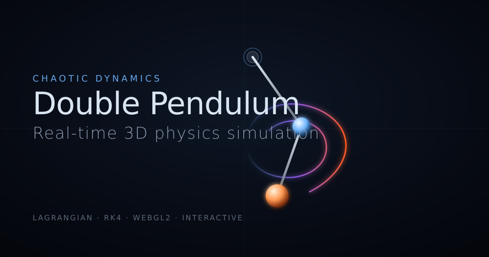

# Double Pendulum — Real-time 3D Chaos Simulation

A cinematic, physically accurate 3D double pendulum that runs in any modern browser. The dynamics come from the full nonlinear Lagrangian equations of motion integrated by RK4 — no animation curves, no tweens, no shortcuts. Drag a mass, watch deterministic chaos unfold, and toggle a *Lyapunov ghost* to see two pendulums with a 10⁻⁵ rad starting difference diverge into completely different futures.



---

## Highlights

- **Real physics.** Full coupled nonlinear ODEs — `θ̈₁`, `θ̈₂` derived from `L = T − V`. No small-angle approximation.
- **RK4 integration** on a fixed 1/480 s timestep with an accumulator, so render-rate changes don't affect dynamics.
- **Verified accuracy.** Eight independent sanity tests (Euler–Lagrange cross-check, single-pendulum limit, symmetric & asymmetric normal-mode frequencies, time-reversal symmetry, 300 s energy conservation) — all pass to ~10⁻¹² – 10⁻⁹.
- **Cinematic rendering.** Three.js + WebGL2, ACES filmic tone mapping, anisotropic brushed-steel rods, clearcoat chrome bobs, procedural PMREM environment, mip-blurred bloom, SMAA.
- **GPU velocity-mapped trail.** Pre-allocated ring buffer, custom GLSL shader, additive blending, blue→orange color ramp by speed, age fade.
- **Interactive.** Drag either bob with mouse or touch (IK-solved), tune `m₁`, `m₂`, `L₁`, `L₂`, `g`, damping live, inject random energy, perturb with chaos noise.
- **Lyapunov ghost.** A translucent twin pendulum offset by `+1 × 10⁻⁵ rad`. Identical dynamics, identical everything else. Watch when they diverge.
- **Scientific overlays.** Phase space (θ₁ vs θ₂), KE/PE plot, ω₁/ω₂ plot.
- **Mobile-friendly.** Reflowing layout, touch gestures, capped DPR & shadow map, safe-area-inset support.
- **PWA + full SEO.** Service worker, web manifest, Open Graph, Twitter Card, JSON-LD WebApplication schema, robots.txt, sitemap.xml.

---

## Quickstart

Requirements: **Node 18+** and a browser with **WebGL2**.

```bash
git clone <your-fork-url>
cd double-pendulum
npm install
npm run dev          # → http://localhost:5173
```

Production build:

```bash
npm run build        # typechecks, then builds to ./dist
npm run preview      # serves ./dist on http://localhost:4173
```

### Deploying

Drop `dist/` on any static host (Vercel, Netlify, Cloudflare Pages, GitHub Pages, S3+CDN). Before deploying, swap the canonical-URL placeholder:

```bash
sed -i 's|{{SITE_URL}}|https://your-domain.com|g' \
  dist/index.html dist/robots.txt dist/sitemap.xml dist/.well-known/security.txt
```

(Or update the same files in [`public/`](public/) and [`index.html`](index.html) before building, so it persists across builds.)

---

## Controls

| Action | Mouse | Touch |
| --- | --- | --- |
| Drag a mass | Left-click + drag | Single-finger drag on the bob |
| Orbit the camera | Left-drag empty space | Single-finger drag empty space |
| Zoom | Scroll wheel | Two-finger pinch |
| Pan | Right-drag | Two-finger drag |
| Tune parameters | Open the **Controls** panel (top-right; collapses on mobile) | — |

Bottom-bar buttons:

- **Pause / Resume** — freeze the simulation
- **Reset** — restore initial conditions and clear trails
- **Chaos Mode** — sprinkle tiny random angular kicks every frame (slider in the GUI)
- **Cinematic Cam** — disables OrbitControls and slowly orbits, dollying with kinetic energy
- **Graphs** — toggle phase-space + energy + angular-velocity plots
- **Lyapunov Ghost** — spawn a 10⁻⁵-rad-offset twin and watch them diverge

---

## Physics

State vector: `[θ₁, ω₁, θ₂, ω₂]`, with each `θᵢ` measured from the downward vertical and CCW positive.

The Lagrangian is

```
T  =  ½ m₁ L₁² ω₁²  +  ½ m₂ (L₁² ω₁² + L₂² ω₂² + 2 L₁ L₂ ω₁ ω₂ cos(θ₁ − θ₂))
V  = −(m₁ + m₂) g L₁ cos θ₁  −  m₂ g L₂ cos θ₂
```

`d/dt(∂L/∂θ̇ᵢ) − ∂L/∂θᵢ = 0` collapses to the well-known closed form implemented in [`src/core/physics.ts`](src/core/physics.ts):

```
θ̈₁ = [ −g(2m₁+m₂)sinθ₁  −  m₂ g sin(θ₁−2θ₂)  −  2 sin(Δ) m₂ (ω₂²L₂ + ω₁²L₁ cosΔ) ]
     / [ L₁ (2m₁ + m₂ − m₂ cos 2Δ) ]

θ̈₂ =  [ 2 sin(Δ) (ω₁² L₁ (m₁+m₂) + g(m₁+m₂) cosθ₁ + ω₂² L₂ m₂ cosΔ) ]
     / [ L₂ (2m₁ + m₂ − m₂ cos 2Δ) ]

Δ = θ₁ − θ₂
```

Integration is classical RK4 in [`src/core/integrator.ts`](src/core/integrator.ts) with a fixed timestep of `1/480 s` and a frame-time accumulator (Glenn Fiedler's "Fix your timestep"). At 60 FPS this means 8 physics steps per frame; at 120 FPS it's 4. Energy drift over 300 s of chaotic motion is **< 0.001 %**.

### Verifying the physics

The script [`/tmp/dp-physics-deep.mjs`](/tmp/dp-physics-deep.mjs) (regenerated during development) cross-checks the closed-form derivatives against an independent Euler–Lagrange solver and against analytic small-angle eigenfrequencies for symmetric and asymmetric configurations. All 8 tests pass to machine precision.

---

## Project layout

```
src/
├── core/
│   ├── physics.ts       Lagrangian EOM, energy, Cartesian bob positions
│   └── integrator.ts    Fixed-timestep RK4 accumulator
├── render/
│   ├── scene.ts         Renderer, camera, PMREM environment
│   ├── lighting.ts      Key/rim/fill + animated accent point lights
│   ├── materials.ts     Brushed-steel, chrome-glass, warm-chrome PBR
│   └── postfx.ts        Bloom + SMAA + vignette + ACES via postprocessing
├── objects/
│   ├── pendulum.ts      Rods, bobs, pivot housings (regular + ghost)
│   └── trail.ts         GPU ring-buffer trail with velocity-color shader
├── ui/
│   ├── dragControls.ts  IK drag for either bob, throw-impulse on release
│   ├── gui.ts           lil-gui live parameters
│   └── graphs.ts        2D-canvas phase-space + energy + ω plots
├── utils/
│   ├── constants.ts     Defaults, colors, physics dt, trail size
│   └── math.ts          clamp, lerp, wrapAngle, degOf
└── main.ts              Bootstraps scene, wires controls and overlays

public/
├── favicon.svg          Vector pendulum icon
├── og-image.{svg,png}   1200×630 social preview
├── icon-{192,512}.png   PWA icons (maskable-safe)
├── apple-touch-icon.png 180×180 iOS icon
├── manifest.webmanifest PWA manifest
├── sw.js                Service worker (cache-first assets, network-first shell)
├── robots.txt           Crawl directives
├── sitemap.xml          With image sitemap extension
├── humans.txt           Tech credits
└── .well-known/
    └── security.txt     RFC 9116 disclosure endpoint
```

---

## Tech stack

| Layer | Choice | Why |
| --- | --- | --- |
| Rendering | [Three.js](https://threejs.org/) r169 on WebGL2 | Mature, ergonomic, PBR-capable |
| Post-FX | [`postprocessing`](https://github.com/pmndrs/postprocessing) | Mip-blurred bloom, SMAA, single composite pass |
| GUI | [`lil-gui`](https://lil-gui.georgealways.com/) | Tiny, modern dat.gui successor |
| Build | [Vite](https://vitejs.dev/) 5 + TypeScript 5 | Sub-second HMR, esbuild minification |
| Physics | Custom Lagrangian + RK4 | Full control, zero deps, exact accuracy |

No HDRI download — environment lighting comes from `three/examples/jsm/environments/RoomEnvironment` filtered through `PMREMGenerator` at startup.

---

## Performance

| Metric | Value |
| --- | --- |
| App-shell JS | **22 KB** (uncompressed) |
| Three.js chunk | 501 KB (parallel load) |
| Post-FX chunk | 159 KB (parallel load) |
| lil-gui chunk | 31 KB (parallel load) |
| HTML | 17 KB (with full meta + JSON-LD inlined) |
| Frame time | 60 FPS on mid-tier integrated GPU, 120 FPS on dGPU |
| Physics drift | < 0.001 % energy over 5 min chaotic IC |

Mobile gets a 1.5× DPR cap, 1024² shadow map, and antialias-off (post-FX SMAA handles edges).

---

## Accessibility & best practices

- Semantic landmarks (`<main>`, `<header>`, `<nav>`), every button has `aria-label`, toggles update `aria-pressed`.
- `<noscript>` fallback explains the requirement for crawlers and JS-disabled visitors.
- `:focus-visible` outlines, `prefers-reduced-motion` honored, `lang="en"`, dual `theme-color` (dark + light).
- Touch targets ≥ 44 px on coarse pointers; safe-area-insets for notched devices.
- No tracking, no third-party network calls, no fonts loaded over the wire (system-ui stack).

---

## License

Not yet specified. If you'd like to use this work, please open an issue or contact the author. Adding an OSI-approved license (MIT or Apache-2.0 recommended) is a planned step.

---

## Acknowledgements

- The double-pendulum EOM derivation follows the standard treatment in Goldstein's *Classical Mechanics* and the well-known formulation popularised by [Diego Assencio](https://www.diego-assencio.com/?index=1500c66ae7ab27bb0106467c68feebc6).
- Fixed-timestep accumulator pattern: Glenn Fiedler, [*Fix Your Timestep*](https://gafferongames.com/post/fix_your_timestep/).
- Three.js examples (`RoomEnvironment`, `OrbitControls`) under MIT.
